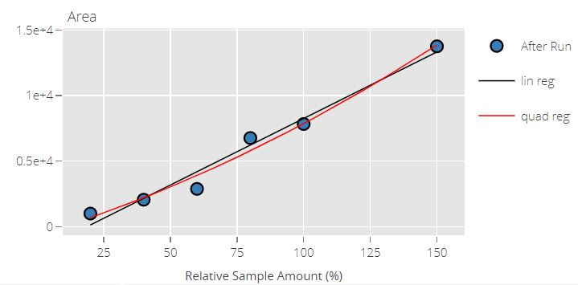

---
output:
  md_document:
    variant: gfm
---

```{r, include = FALSE}
knitr::opts_chunk$set(
  collapse = TRUE,
  comment = "#>",
  fig.align = 'center'
)
```

# Quarto Report Example With Plotly and Trelliscopejs

Here is a report showing how to create injection sequence plot and dilution plot using [`plotly`](https://plotly.com/r/) for each transition.

## Injection Sequence Plot

{fig-alt="An injection sequence plot."}

## Dilution Plot

{fig-alt="A dilution plot."}

These multiple interactive plots will be displayed as a trellis using [`trelliscopejs`](https://hafen.github.io/trelliscopejs/).

