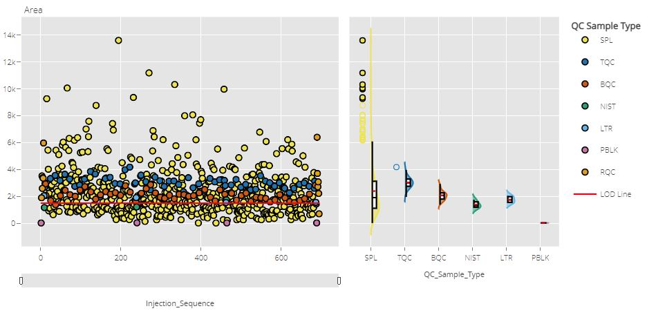

# Quarto Report Example With Plotly and Trelliscopejs

Here is a report showing how to create injection sequence plot and
dilution plot using [`plotly`](https://plotly.com/r/) for each
transition.

## Injection Sequence Plot

<figure>

<figcaption aria-hidden="true">Injection Sequence Plot</figcaption>
</figure>

## Dilution Plot

<figure>

<figcaption aria-hidden="true">Dilution Plot</figcaption>
</figure>

These multiple interactive plots will be displayed as a trellis using
[`trelliscopejs`](https://hafen.github.io/trelliscopejs/).

Refer to the [NEWS.md
file](https://github.com/JauntyJJS/Trelliscopejs_In_Quarto_Example/blob/main/NEWS.md)
to see what is being worked on as well as update to changes between back
to back versions.
